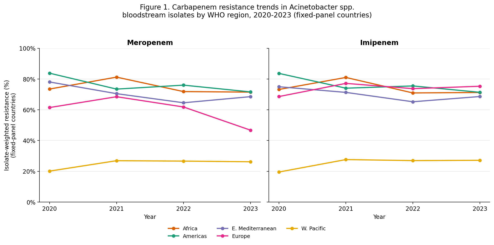
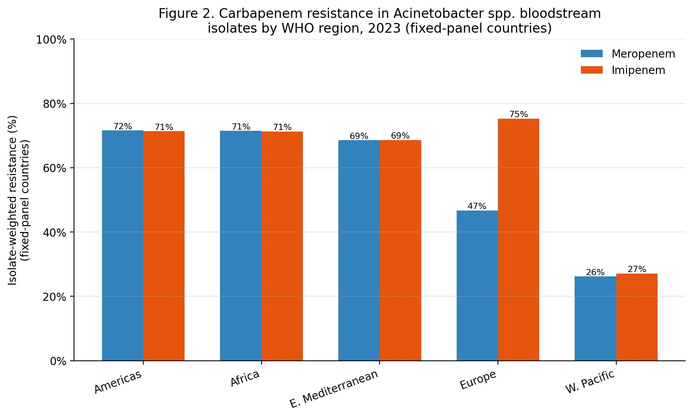

# Regional and Temporal Trends in Carbapenem Resistance Among *Acinetobacter* spp. Bloodstream Isolates: A Descriptive Analysis of WHO GLASS Surveillance Data, 2020-2023

**Dr. Mohammad Waqas Farhat**
*Independent Researcher; IReS (Internal Medicine Research and Study Group); graduate, Ivane Javakhishvili Tbilisi State Medical University, Tbilisi, Georgia*
ORCID: [0009-0001-3267-6668](https://orcid.org/0009-0001-3267-6668)

**Draft manuscript, prepared for preprint submission (medRxiv)**

---

## Abstract

Carbapenem-resistant *Acinetobacter baumannii* is among the highest-priority pathogens identified by the World Health Organization for antimicrobial resistance (AMR) surveillance and drug development. We conducted a descriptive analysis of country-reported resistance data for *Acinetobacter* spp. bloodstream infections submitted to the WHO Global Antimicrobial Resistance and Use Surveillance System (GLASS) between 2020 and 2023, focusing on resistance to the two most clinically relevant carbapenems, meropenem and imipenem. Because the set of countries reporting to GLASS changes from year to year, we restricted our primary analysis to a fixed panel of countries with continuous reporting across all four years within each WHO region, to isolate genuine temporal change from shifts in reporting composition. Carbapenem resistance among *Acinetobacter* spp. bloodstream isolates remained substantial across all six WHO regions throughout the study period, ranging from approximately 20-27% in the Western Pacific Region to 61-83% in the Region of the Americas, African Region, and Eastern Mediterranean Region. The Western Pacific Region showed consistently and substantially lower resistance than all other regions across every study year. Several regions showed modest declines over the study period once panel composition was controlled for, though findings should be interpreted cautiously given small country counts in some regions and known limitations of passive surveillance data. This analysis establishes a reproducible pipeline for regional AMR trend monitoring and identifies the Western Pacific Region's comparatively low resistance burden as warranting further investigation.

---

## 1. Introduction

*Acinetobacter baumannii* is classified by the WHO as a critical-priority pathogen for antibiotic research and development [1], owing to its propensity for multidrug resistance and its clinical significance in hospital-acquired, particularly intensive care unit (ICU)-associated, bloodstream infections [3]. Carbapenems (meropenem, imipenem) have historically served as last-line agents against Gram-negative pathogens including *A. baumannii*; rising carbapenem resistance therefore has direct implications for empirical treatment protocols and patient outcomes in critical care settings.

The WHO Global Antimicrobial Resistance and Use Surveillance System (GLASS) aggregates country-reported antimicrobial susceptibility testing (AST) data and represents the most comprehensive publicly available cross-national AMR dataset [2]. However, GLASS data present a well-recognized analytical challenge: participating countries, and the completeness of their reporting, change from year to year, meaning naive pooled or averaged statistics across years can conflate genuine epidemiological trends with shifts in which countries are contributing data. This distinction matters for how surveillance findings should be interpreted and communicated.

This analysis had two aims: (1) to describe regional and temporal patterns in carbapenem resistance among *Acinetobacter* spp. bloodstream isolates reported to GLASS between 2020 and 2023, and (2) to demonstrate a methodologically defensible approach to isolating genuine trends from reporting-panel artifacts in cross-national surveillance data of this kind.

## 2. Methods

### 2.1 Data source

Country-level resistance data were obtained from the WHO GLASS-AMR data visualization dashboard (accessed 2026), filtered to: infection type = bloodstream, pathogen = *Acinetobacter* spp., years 2020-2023, all six WHO regions (African Region, Region of the Americas, Eastern Mediterranean Region, European Region, South-East Asia Region, Western Pacific Region). For each country-year-antibiotic combination, the dashboard provides the number of bacteriologically confirmed infections with interpretable AST results and the number found resistant.

South-East Asia Region data for 2021 were unavailable via the dashboard export at the time of data collection and are excluded from that region-year; all other region-year combinations were successfully retrieved.

### 2.2 Antibiotic scope

Analysis was restricted to the two carbapenems reported in GLASS for this pathogen-specimen combination: meropenem and imipenem. These were selected as the clinically most consequential agents for treatment decision-making in carbapenem-resistant *Acinetobacter* infection.

### 2.3 Handling of the reporting-panel problem

Because the number and identity of reporting countries varies by year within each region (Supplementary Table S1), a simple pooled resistance percentage across all reporting countries in a given year can be confounded by compositional change (e.g., a newly reporting low-resistance country entering the panel can mechanically lower an apparent regional average without any country's true resistance rate having changed). To address this, our primary analysis restricts each region to the fixed subset of countries that reported continuously in all four years (2020-2023), and computes an isolate-weighted (pooled) resistance percentage across that fixed panel for each year: 

pooled resistance % = (Σ resistant isolates across fixed-panel countries) / (Σ tested isolates across fixed-panel countries) × 100

This isolate-weighting approach gives appropriate influence to higher-volume-testing countries rather than treating each country's percentage as equally weighted regardless of sample size. A secondary, unrestricted (all-reporting-countries-per-year) pooled analysis is presented in Supplementary Table S2 for comparison.

### 2.4 Limitations of source data

GLASS is a passive surveillance system dependent on national laboratory capacity and reporting infrastructure; countries with limited AST capacity may test disproportionately severe or treatment-refractory cases, potentially biasing reported resistance upward relative to the true community/hospital burden. Regions and years with very few reporting countries (e.g., Region of the Americas, 3 countries in the fixed panel) or low total tested isolates yield estimates with greater uncertainty than regions with broader reporting (e.g., European Region, 22-24 countries in the fixed panel). No statistical significance testing was performed given the observational, non-randomly-sampled nature of national surveillance reporting; findings are presented descriptively.

## 3. Results

### 3.1 Dataset overview

After combining all available region-year exports and removing exact duplicate records, the dataset comprised 1,353 country-antibiotic-year observations for *Acinetobacter* spp. bloodstream infections across all antibiotics tracked in GLASS. Restricting to meropenem and imipenem yielded 532 country-drug-year observations.

### 3.2 Fixed-panel resistance trends by region

**Table 1. Isolate-weighted carbapenem resistance (%) among fixed-panel countries reporting continuously 2020-2023, by WHO region.**

| Region | Fixed-panel countries (n) | 2020 | 2021 | 2022 | 2023 |
|---|---|---|---|---|---|
| Western Pacific Region | 4-6 | 20% | 27% | 27% | 27% |
| European Region | 22-24 | 61-69% | 68-77% | 62-74% | 47-75%¹ |
| Eastern Mediterranean Region | 11 | 75-78% | 70-71% | 65% | 68-69% |
| African Region | 2-3 | 73-74% | 81% | 71-72% | 71-72% |
| Region of the Americas | 3 | 84% | 73-74% | 75-76% | 71-72% |

¹ Meropenem and imipenem diverge notably in European Region 2023 (47% vs. 75% respectively); see Discussion.

Values presented as approximate ranges across the two carbapenems (meropenem, imipenem individually available in full results table).

**Figure 1.** Isolate-weighted carbapenem resistance among *Acinetobacter* spp. bloodstream isolates, fixed-panel countries, by WHO region, 2020-2023. Left: meropenem. Right: imipenem. South-East Asia Region is excluded from this figure because it lacks a complete 4-year reporting panel (2021 data unavailable).

The Western Pacific Region showed consistently and substantially lower carbapenem resistance than every other region in every study year, a pattern that persisted after fixed-panel correction and is therefore unlikely to be a reporting artifact. The African Region and Region of the Americas showed the highest resistance levels in most years, exceeding 70% in three of four years each.

### 3.3 Effect of panel-composition correction

The unrestricted, all-reporting-countries pooled analysis (Supplementary Table S2) suggested a substantially steeper decline in Region of the Americas resistance (84% to 35% for meropenem, 2020-2023) than the fixed-panel analysis (84% to 72%). This divergence was attributable to the addition of Colombia (2021 onward) and Canada (2023) to the reporting panel, both of which reported lower resistance than the original three countries. This finding illustrates the material impact panel composition can have on apparent regional trends in GLASS-derived analyses and supports the use of fixed-panel or otherwise composition-adjusted approaches when characterizing temporal change in multi-country surveillance data.

**Figure 2.** Carbapenem resistance among *Acinetobacter* spp. bloodstream isolates by WHO region, 2023 snapshot, fixed-panel countries. Regions ordered by meropenem resistance, descending. South-East Asia Region is excluded (no complete 4-year fixed panel available for direct comparison with the other regions shown).

## 4. Discussion

This descriptive analysis found substantial and sustained carbapenem resistance among *Acinetobacter* spp. bloodstream isolates across most WHO regions between 2020 and 2023, consistent with the pathogen's designation as a critical-priority target for AMR intervention. The consistently lower resistance observed in the Western Pacific Region across all four years, and unaffected by panel-composition correction, is a pattern meriting further investigation; possible contributing factors could include differences in antimicrobial stewardship infrastructure, infection prevention and control practices, or case-mix among the higher-income countries with continuous reporting in this region's fixed panel (Australia, Japan, Republic of Korea), though these explanations are speculative and outside the scope of this descriptive dataset.

The panel-composition analysis presented here (Section 3.3) demonstrates a broader methodological point relevant to any analysis of GLASS or similarly structured multi-country surveillance data: apparent temporal trends computed from all available reporting countries in each year can be substantially confounded by which countries are reporting, independent of true epidemiological change. Future work using GLASS data for trend analysis should explicitly report and, where feasible, adjust for reporting-panel composition.

### 4.1 Comparison with published literature

Our regional resistance estimates should be compared cautiously against published literature, since prior studies often report different metrics that are not always directly comparable to a GLASS-style "percentage of tested isolates resistant." A systematic review and meta-analysis of hospital-acquired *A. baumannii* across Europe, the Eastern Mediterranean, and Africa reported incidence and proportion-of-infections metrics (e.g., carbapenem-resistant *A. baumannii* accounted for 13.6% of all hospital-acquired infections in ICUs, with an incidence of 41.7 cases per 1,000 patients) rather than a resistance percentage among tested isolates [3]; while this establishes the clinical burden of CRAB in the same WHO regions examined here, it is a different measure than the present analysis and we do not claim direct numerical consistency with it. A systematic review and meta-analysis of sub-Saharan African isolates reported a pooled CRAB prevalence of 20% (95% CI: 4-43%) [4], notably lower than our African Region fixed-panel estimate (71-74%). We believe this divergence may reflect a difference in what "prevalence" captures in each analysis (their pooled estimate draws on 14 published studies with a stated denominator we could not fully reconcile with GLASS's per-isolate resistance-testing framework) rather than a genuine contradiction in underlying epidemiology, but we are not confident enough in that explanation to assert it, and flag this as an open discrepancy requiring further methodological comparison rather than resolving it here.

One point of divergence is clearer and better supported. A large recent meta-analysis of 795 published studies spanning 1995-2023 reported a "steady upward trend" in global carbapenem resistance, with the 2020-2023 period showing the highest pooled resistance observed across the entire study period (meropenem 80.7%, carbapenems overall 81.0%, confirmed by meta-regression) [5]. This contrasts with the present analysis, in which several regions (Region of the Americas, Eastern Mediterranean Region) showed modest declines over the same 2020-2023 window once panel composition was controlled for, and no region showed a rise approaching the 81% figure reported by that meta-analysis except at the high end of individual country ranges. We believe this divergence most plausibly reflects a difference in data source and associated bias direction rather than a genuine contradiction: literature-based meta-analyses aggregate published, peer-reviewed studies, which are disproportionately drawn from tertiary referral centers, outbreak investigations, and settings motivated to publish because resistance was notably high, a bias the source study itself explicitly identifies via significant Egger's test results across all studied antibiotics. By contrast, GLASS aggregates routine national surveillance data intended to be more representative of general bloodstream infection cases within reporting countries, though it carries its own, different limitations (Section 4.2, below). Reconciling estimates derived from published-literature meta-analyses versus routine national surveillance systems is an open methodological question in the AMR field and is not resolved by the present descriptive analysis; we flag it here so the apparent discrepancy is transparent rather than obscured.

### 4.2 Limitations

This is a descriptive, hypothesis-generating pilot analysis rather than a causal or fully adjusted epidemiological study. Key limitations include: reliance on passive, non-randomly-sampled national surveillance data of variable quality and completeness; small fixed-panel country counts in several regions (as few as 2-3 countries), limiting generalizability of regional estimates; absence of patient-level clinical or demographic covariates; and unavailability of South-East Asia Region 2021 data. Findings should be interpreted as describing patterns among reporting countries and isolates, not as unbiased estimates of true population-level resistance prevalence.

### 4.3 Future directions

This analysis establishes a reproducible data pipeline (publicly available, see Data and Code Availability) that can be extended to additional pathogens, specimen types, and antibiotic classes within GLASS, and could be integrated with genomic resistance-determinant data from public repositories (e.g., NCBI Pathogen Detection, CARD) to examine whether phenotypic resistance trends correspond to underlying resistance gene prevalence at the country or regional level, a direction the authors intend to pursue.

## 5. Conclusion

Carbapenem resistance among *Acinetobacter* spp. bloodstream isolates remained high across most WHO regions from 2020 to 2023, with the Western Pacific Region a consistent outlier at substantially lower resistance levels. Reporting-panel composition materially affects apparent regional trends in GLASS-derived analyses and should be explicitly addressed in future surveillance-based AMR research.

## Data and Code Availability

Source data were obtained from the publicly accessible WHO GLASS-AMR dashboard (https://worldhealthorg.shinyapps.io/glass-dashboard/). Analysis code and combined datasets are available at https://github.com/DocWaqas/acinetobacter-carbapenem-glass-trends.

## Author Contributions

Mohammad Waqas Farhat conceived the analysis, collected and processed the data, conducted the analysis, and drafted the manuscript.

## Conflicts of Interest

None declared.

---

## Supplementary Table S1: Fixed-panel country lists by region

| Region | Countries (reported all 4 years) |
|---|---|
| African Region (imipenem) | Mauritius, South Africa |
| African Region (meropenem) | Ethiopia, Mauritius, South Africa |
| Eastern Mediterranean Region | Bahrain, Iran, Iraq, Jordan, Kuwait, Oman, Pakistan, Qatar, Saudi Arabia, Tunisia, United Arab Emirates |
| European Region (imipenem) | 22 countries including Austria, Belgium, Croatia, Germany, Italy, Poland, Ukraine, United Kingdom |
| European Region (meropenem) | 24 countries, overlapping list plus Denmark, Finland, Ireland |
| Region of the Americas | Argentina, Brazil, Peru |
| Western Pacific Region (imipenem) | Australia, Japan, Philippines, Republic of Korea |
| Western Pacific Region (meropenem) | Australia, Brunei Darussalam, Japan, Philippines, Republic of Korea, Singapore |

*Full country lists available in repository.*

## Supplementary Table S2: Unrestricted (all-reporting-countries) pooled resistance, for comparison

*See repository file `carbapenem_pooled_summary.csv` for complete unrestricted pooled figures by region, year, and drug, including South-East Asia Region.*

---

## References

1. World Health Organization. *WHO Bacterial Priority Pathogens List, 2024: Bacterial Pathogens of Public Health Importance to Guide Research, Development and Strategies to Prevent and Control Antimicrobial Resistance.* Geneva: WHO; 2024.
2. World Health Organization. *GLASS Manual for Antimicrobial Resistance Surveillance in Common Bacteria Causing Human Infection.* Geneva: World Health Organization; 2023.
3. Ayobami O, Willrich N, Harder T, Okeke IN, Eckmanns T, Markwart R. The incidence and prevalence of hospital-acquired (carbapenem-resistant) *Acinetobacter baumannii* in Europe, Eastern Mediterranean and Africa: a systematic review and meta-analysis. *Emerg Microbes Infect.* 2019;8(1):1747-1759.
4. Arowolo MT, Orababa OQ, Olaitan MO, Osibeluwo BV, Essiet UU, Batholomew OH, et al. Prevalence of carbapenem resistance in *Acinetobacter baumannii* and *Pseudomonas aeruginosa* in sub-Saharan Africa: a systematic review and meta-analysis. *PLoS One.* 2023;18(11):e0287762.
5. Beig M, Parvizi E, Navidifar T, Bostanghadiri N, Mofid M, Golab N, Sholeh M. Geographical mapping and temporal trends of *Acinetobacter baumannii* carbapenem resistance: a comprehensive meta-analysis. *PLoS One.* 2024;19(12):e0311124.
